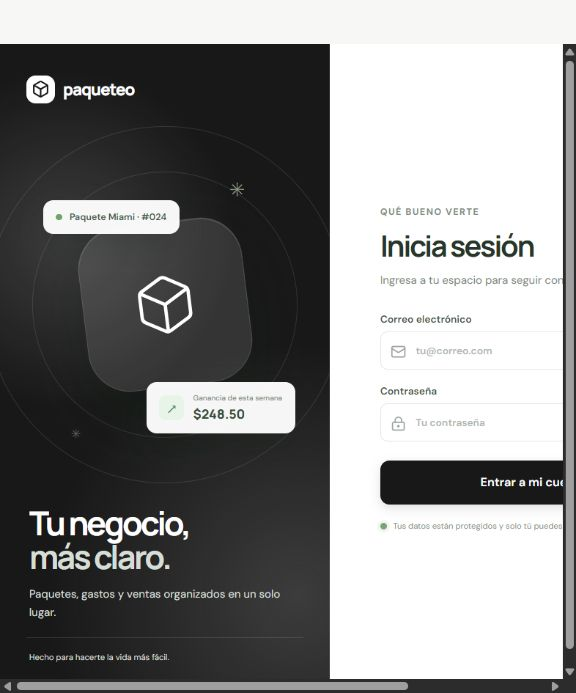

# Paqueteo

Aplicación web en español para organizar paquetes, productos, gastos, ventas e inventario. React y Vite forman la interfaz; Supabase Auth y Postgres guardan los datos y los aíslan por usuario.

## Portal



## Requisitos

- Node.js 20.19 o posterior.
- Un proyecto de Supabase.

## Preparar Supabase

1. En el panel de Supabase, abre **SQL Editor** y ejecuta [`supabase/migrations/202610080001_initial_schema.sql`](supabase/migrations/202610080001_initial_schema.sql).
2. En Authentication, crea una cuenta de correo y contraseña para cada usuario de la aplicación.
3. Copia `.env.example` como `.env.local` y agrega la URL del proyecto y la clave publicable/anon del proyecto:

   ```text
   VITE_SUPABASE_URL=https://tu-proyecto.supabase.co
   VITE_SUPABASE_ANON_KEY=tu-clave-publica
   ```

   No uses la clave `service_role` en el navegador.

## Ejecutar

```bash
npm install
npm run dev
```

Abre la dirección local que muestre Vite. Para generar una compilación de producción:

```bash
npm run build
npm run preview
```

Los cambios de paquetes, productos, gastos e importaciones se guardan en Supabase. La venta y la importación usan funciones SQL transaccionales para conservar inventario y evitar duplicados al reintentar una misma operación.

La importación permite cargar `.xlsx` o `.csv`; la plantilla descargable de productos está en formato Excel. En gastos también está disponible la categoría **Pago al vendedor**.

El color de marca se puede elegir entre negro (`#181818`), verde (`#32553E`) y blanco; la selección se conserva en el navegador.
